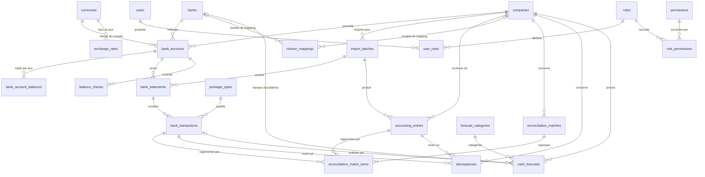

# Modèle de données

Schéma PostgreSQL de SIMTIS Finance (phase P4), 25 tables. Il est décrit par les modèles SQLAlchemy de `backend/app/models/` et versionné par Alembic (`backend/alembic/versions/`). En cas de doute, le code fait foi.

## Conventions

- **Argent** : `NUMERIC(18,2)` en base, `Decimal` en Python, jamais `float`. Les taux sont en `NUMERIC(18,6)` (un taux d'intérêt de 4,5 % s'enregistre `0.045000`). Le score d'un rapprochement est en `NUMERIC(5,2)`.
- **Statuts** : enregistrés avec leur libellé français (« À vérifier », « Clôturé »…) et vérifiés par des `CHECK`. Les listes sont dans `backend/app/models/enums.py`.
- **Société** : les comptes, imports, écritures, correspondances, écarts et prévisions appartiennent à une société. Rien n'est consolidé entre sociétés.
- **Noms de contraintes** : `pk_`, `fk_`, `uq_`, `ck_`, `ix_` suivis du nom de la table. Une erreur de la base cite donc la règle violée.
- **Horodatage** : `created_at` et `updated_at` renseignés par la base, sauf `audit_logs` (`created_at` seulement).

## Diagramme



`audit_logs` et `reconciliation_rules` n'ont aucune relation : le journal doit survivre à la suppression d'un utilisateur, et les règles sont de simples paramètres. Les liens vers `users` (saisi par, validé par, responsable, clôturé par…) existent mais ne sont pas dessinés, pour garder le schéma lisible.

## Tables par domaine

### Référentiel

| Table | Rôle | Points d'attention |
|---|---|---|
| `companies` | Sociétés (Simtis, Société X) | Le nom de « Société X » est provisoire et se modifie en base |
| `banks` | Banques | `code` (AWB, BMCE, BP, CIH, BMCI) sert d'en-tête de colonne ; `ordre_affichage` fixe leur ordre |
| `currencies` | MAD, EUR, USD | « Exp DH convertible » n'est pas une devise |
| `pointage_types` | Types d'opération du champ « Pointage » | Liste ouverte, modifiable |
| `bank_accounts` | Comptes bancaires d'une société | `credit_autorise` = LIGNE ; `taux_interet` = Taux ; `type_compte` = Courant ou DH convertible (toujours en MAD) |
| `bank_account_balances` | Solde et crédit utilisé **par compte et par jour** | Une ligne par compte et par date. Alimente les lignes « facilité de caisse » |
| `exchange_rates` | Taux de change saisis à la main | Un taux par devise et par jour, strictement positif |

### Imports et écritures

| Table | Rôle | Points d'attention |
|---|---|---|
| `import_batches` | Un fichier importé (relevé ou export comptable) | Un même fichier ne peut être **confirmé** qu'une fois par société et par type |
| `column_mappings` | Correspondance colonnes du fichier vers champs standard | Mémorisée par banque (JSONB) |
| `bank_statements` | Un relevé par compte et période | — |
| `bank_transactions` | Mouvements bancaires normalisés | `montant` = crédit − débit. Unique sur (compte, `hash_ligne`) contre les doublons |
| `accounting_entries` | Écritures importées de Sage / SI | Jamais créées dans SIMTIS. Unique sur (société, `hash_ligne`) |

### Rapprochement et écarts

| Table | Rôle | Points d'attention |
|---|---|---|
| `reconciliation_rules` | Critères de la grille de score | Vide : la grille n'est pas encore validée |
| `reconciliation_matches` | Correspondance 1-1, 1-N, N-1 ou N-N | Validée seulement avec validateur et date |
| `reconciliation_match_items` | Une transaction **ou** une écriture d'une correspondance | Exactement un lien par ligne |
| `balance_checks` | Contrôle du solde du relevé | Conforme, Écart ou À vérifier |
| `discrepancies` | Écarts à traiter | Clôture impossible sans commentaire, date et responsable |

### Prévisions

| Table | Rôle | Points d'attention |
|---|---|---|
| `forecast_categories` | Encaissement, Escompte, Douane, Paie, Refinancement, Chèques, Autre | `sens_par_defaut` seulement quand il est certain (voir plus bas) |
| `cash_forecasts` | Flux de trésorerie prévus | Société obligatoire, banque facultative, sens propre à chaque prévision |

### Sécurité

| Table | Rôle | Points d'attention |
|---|---|---|
| `users`, `roles`, `permissions`, `user_roles`, `role_permissions` | Droits dynamiques | Email en minuscules et unique. Les mots de passe seront hachés en P5 |
| `audit_logs` | Journal des actions sensibles | **Ajout seul** : UPDATE, DELETE et TRUNCATE sont refusés par la base |

## Du classeur aux tables

Le classeur `docs/specs/SIMTIS_tableaux_complets.xlsx` est la référence d'affichage. Voici d'où viendra chaque cellule (calculs en P8, P9 et P14, jamais en base) :

| Cellule du classeur | Source |
|---|---|
| En-têtes AWB, BMCE, BP, CIH, BMCI | `banks.code`, triés par `banks.ordre_affichage` |
| Taux | `bank_accounts.taux_interet`, affiché en % |
| LIGNE | `bank_accounts.credit_autorise` |
| facilité de caisse, avec sa date | `bank_account_balances` : une ligne par jour (`date_solde`, `solde`, `credit_utilise`) |
| Disponible Fc reel | Calculé : solde + LIGNE |
| DEPASSEMENT | Calculé (formule à confirmer) |
| TOTAL | Somme par ligne, calculée. Jamais entre devises différentes |
| EUR, USD, Exp DH convertible | Comptes filtrés par `devise` et `type_compte` |
| Bloc Prévisions : Encaissement, Escompte, Douane | `cash_forecasts` sans banque : montant de la journée |
| Bloc Prévisions : colonnes de banques | `cash_forecasts` avec `bank_id` |

## Ce que la base garantit

Ces règles sont vérifiées par `backend/tests/test_constraints.py`, qui cite le nom de chaque contrainte :

- Un relevé ne peut pas contenir deux fois la même ligne, ni une écriture deux fois pour une société.
- `montant` = crédit − débit, débit et crédit jamais négatifs.
- Un statut inconnu est refusé.
- Un écart clôturé a un commentaire, une date et un responsable. Un rapprochement validé a un validateur et une date.
- Un élément de rapprochement pointe vers exactement une transaction ou une écriture.
- Un compte « DH convertible » est en MAD.
- Un solde par compte et par jour. Un taux de change par devise et par jour.
- Le journal d'audit ne peut ni être modifié, ni être supprimé, ni être vidé.
- Un crédit utilisé **peut** dépasser le crédit autorisé : c'est ce que mesure la colonne DEPASSEMENT.

## Ce qui n'est pas en base

- **Les formules** : Crédit disponible, Position disponible, Disponible Fc reel, Dépassement, totaux et position prévisionnelle sont calculés par les services (`backend/app/services/`), à partir des données ci-dessus. Rien n'est stocké en double.
- **La grille de score** du rapprochement (`reconciliation_rules` est vide).
- **Les permissions attachées aux rôles** sont chargées par les seeds mais modifiables ensuite par l'administrateur.

## Points ouverts (plan §3.4)

- **Sens de l'Escompte, du Refinancement et des Chèques** : `sens_par_defaut` reste vide pour ces catégories. Chaque prévision porte son propre `sens`, donc le schéma fonctionne quelle que soit la réponse du métier.
- **Que représente « facilité de caisse »** : solde du compte ou facilité utilisée ? Les deux sont stockés (`solde` et `credit_utilise`).
- **`lettrage_escompte`** : champ texte libre tant que le métier n'a pas défini « Lettrage / Escompte ».
- **Formule du Dépassement** : proposée max(0, −Disponible Fc reel), à confirmer.

## Limite connue des outils

`alembic check` compare colonnes, index et clés, mais **pas les contraintes `CHECK`**. Retirer un `CHECK` d'un modèle sans créer de migration n'est pas détecté par `test_migration_matches_models`. Les tests de `test_constraints.py` sont le filet de sécurité : toute nouvelle règle doit y avoir son test.

## Commandes

```bash
docker compose run --rm backend alembic upgrade head                        # appliquer les migrations
docker compose run --rm backend alembic downgrade base                      # tout défaire (base vide)
docker compose run --rm backend alembic revision --autogenerate -m "..."    # nouvelle migration, à relire avant de l'appliquer
docker compose run --rm backend python -m app.seeds                         # données de référence (aussi au démarrage)
docker compose run --rm backend python -m app.seeds --demo                  # + données de démonstration (développement)
docker compose run --rm backend pytest                                      # tests, sur une base dédiée
```

Le backend applique les migrations et charge les données de référence à chaque démarrage (`docker compose up`). Les données de démonstration sont marquées « DEMO » et refusées quand `APP_ENV=production`.
